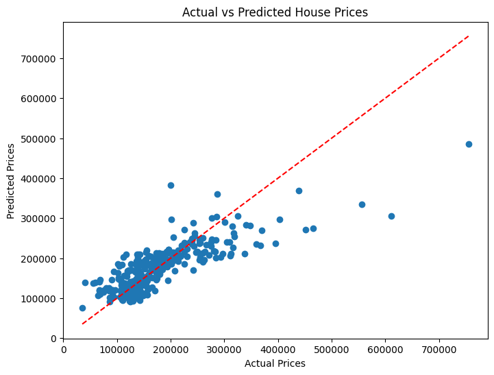

# House Price Prediction using Linear Regression

An end-to-end Machine Learning project developed as part of the Prodigy InfoTech Data Science internship (Task-1).

This model predicts the price of a house (`SalePrice`) based on the identified key features such as `GrLivArea`, `BedroomAbvGr`, and `FullBath`.

---

## 📌 Project Overview

The aim of this project is to implement a clean data pipeline that loads raw real estate data, filters and extracts relevant features, trains a Linear Regression model, evaluates its accuracy ($R^2$ and RMSE) against unseen test data, and provides a clear visual evaluation of the model's performance.

---

## 📊 Dataset Dictionary

The model utilizes a targeted subset of features extracted from the raw `train.csv` file from the Official Kaggle Dataset.

| Raw Column Name | Cleaned Name | Data Type |
| :--- | :--- | :--- |
| `GrLivArea` | Square Footage | Cont. |
| `BedroomAbvGr` | Bedrooms | Integ. |
| `FullBath` | Bathrooms | Integ. |
| `SalePrice` | **SalePrice** *(Target)* | Integ. |

**Source:** [Kaggle Dataset](https://www.kaggle.com/c/house-prices-advanced-regression-techniques/data)

---

## 🛠️ Tech Stack & Dependencies

This project is written natively in Python 3 and relies on standard data science libraries:

* **Pandas:** For data ingestion, manipulation, and structured column renaming.
* **NumPy:** For high-performance mathematical operations (calculating the Root Mean Squared Error).
* **Scikit-Learn:** For data splitting (`train_test_split`), building the machine learning model (`LinearRegression`), and performance scoring.
* **Matplotlib:** For rendering the visual performance diagnostic chart.

---

## 🏗️ Model Architecture & Logic

### 🔗 1. The Mathematical Formula
Under the hood, the model computes the relationship between the features and house prices using the following multi-variable linear equation:

$$\text{SalePrice} = \beta_0 + \beta_1 \cdot \text{SquareFootage} + \beta_2 \cdot \text{Bedrooms} + \beta_3 \cdot \text{Bathrooms}$$

Where:
* $\beta_0$ represents the y-intercept (baseline property land cost).
* $\beta_1, \beta_2, \beta_3$ represent the learned coefficients (feature weights).

### 🔗 2. The Train-Test Split
To prevent overfitting and test real-world generalization, the dataset of 1,460 properties is randomly split into:
* **80% Training Data:** Used by the algorithm to discover mathematical weights.
* **20% Evaluation Testing Data:** Held back completely to act as a blind validation set.

---

## 📉 Performance & Evaluation Metrics

Upon running the script, the model evaluates its predictions on the test set utilizing two key industry standards:
* **RMSE (Root Mean Squared Error):** Quantifies the average distance between the model's predictions and the actual sale prices.
* **$R^2$ (Coefficient of Determination):** Represents the percentage of variance in house prices that our chosen features can successfully explain.

---

## 📈 Visualizing Results

The script outputs an **Actual vs. Predicted Price Plot** to evaluate performance across different price brackets:

### Model Analysis from the Chart:
* **The Red Dashed Line ($y = x$):** Represents a perfect model where prediction matches the actual price exactly.
* **\$100k – \$250k Bracket:** High data density is tightly clustered along the reference line, proving strong baseline reliability for average-priced properties.
* **\$300k+ Bracket (Underprediction Bias):** High-end luxury homes systematically fall below the line of perfect fit. This indicates that while structural metrics (square footage and rooms) anchor a property's base value, premium real estate prices are heavily driven by features outside our 3 isolated variables (e.g., neighborhood quality, luxury build materials, or land size).

---

